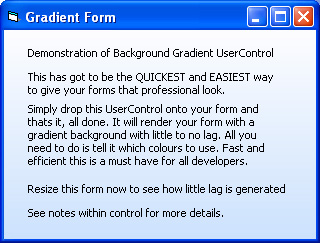



## Form Gradient UserControl

### Description

A useful UserControl that will speed up your development time and give you a great looking GUI. Simply drop the control on your form and thats it, all done. At run time your form will be rendered with a stylish gradient background.

Why should you bother with it when there are plenty of other gradient submissions out there? Because it will reduce your development time and keep your project organised and simple. It is easily transfered between projects. It doesnt repaint your whole form on each WM_PAINT message so generates no lag when other windows move in front of your app. It is clean, fast, and easy to understand. It produces little to no resize lag and can easily be added to any project.

Some submissions are fun, some are educational, this one is FUNCTIONAL. 99% of projects could benifit from this sumbission.
 
### More Info
 

             |
---                |---
**Submitted On**   |2005-02-26 16:17:00
**By**             |[GDuncan](https://github.com/Planet-Source-Code/PSCIndex/blob/master/ByAuthor/gduncan.md)
**Level**          |Intermediate
**User Rating**    |5.0 (90 globes from 18 users)
**Compatibility**  |VB 6\.0
**Category**       |[Graphics](https://github.com/Planet-Source-Code/PSCIndex/blob/master/ByCategory/graphics__1-46.md)
**World**          |[Visual Basic](https://github.com/Planet-Source-Code/PSCIndex/blob/master/ByWorld/visual-basic.md)
**Archive File**   |[Form\_Gradi185914312005\.zip](https://github.com/Planet-Source-Code/gduncan-form-gradient-usercontrol__1-59222/archive/master.zip)

